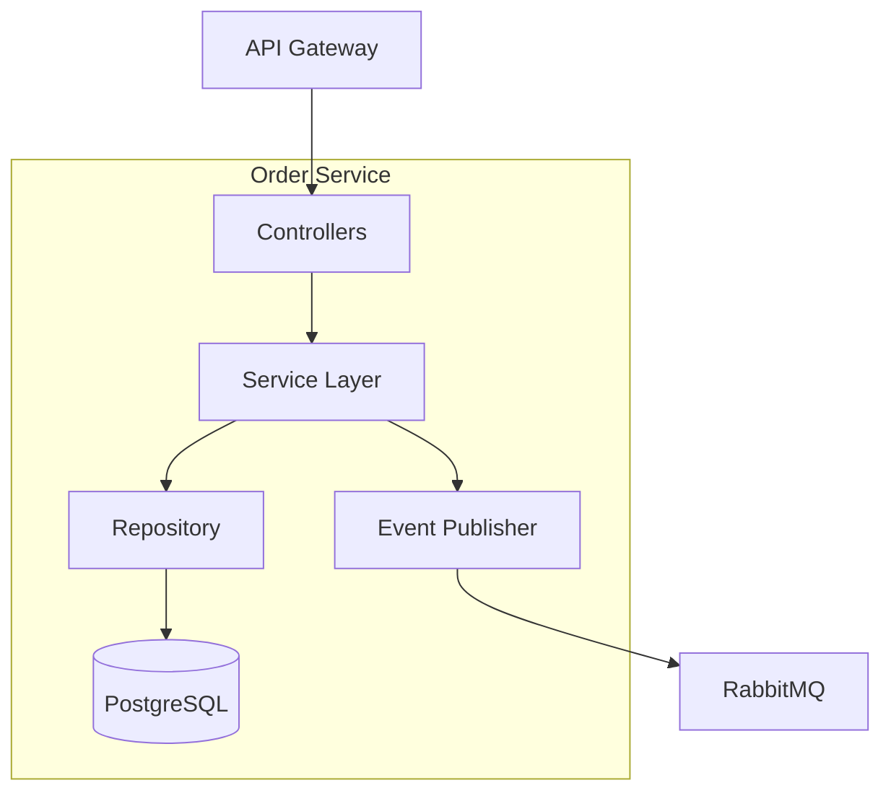

# Shopping Cart Order Service

A Spring Boot microservice that manages the full order lifecycle (creation, payment, fulfillment) for the Shopping Cart platform. It publishes RabbitMQ events for each state change and persists orders in PostgreSQL.

---

## Quick Start

### Prerequisites
- Java 21+
- Maven 3.9+
- PostgreSQL 15+
- RabbitMQ 3.12+

### Install & Run
```bash
# Install dependencies + build
mvn clean package

# Run locally with Docker Compose backing services
Docker compose up -d
mvn spring-boot:run

# Deploy manifests (requires shopping-cart-infra)
kubectl apply -f k8s/
```

### Environment Variables
| Variable | Default | Description |
|----------|---------|-------------|
| `SERVER_PORT` | 8080 | HTTP server port |
| `DB_HOST` | localhost | PostgreSQL host |
| `DB_PORT` | 5432 | PostgreSQL port |
| `DB_NAME` | orders | Database name |
| `DB_USERNAME` | postgres | Database username |
| `DB_PASSWORD` | postgres | Database password |
| `RABBITMQ_HOST` | localhost | RabbitMQ host |
| `RABBITMQ_PORT` | 5672 | RabbitMQ AMQP port |
| `VAULT_ENABLED` | false | Enable Vault integration |
| `VAULT_ADDR` | http://localhost:8200 | Vault address |
| `VAULT_ROLE` | order-publisher | Vault role for RabbitMQ |

---

## Usage

### Architecture



### Event Publishing
| Event | Routing Key | Description |
|-------|-------------|-------------|
| `order.created` | `order.created` | New order placed |
| `order.paid` | `order.paid` | Payment confirmed |
| `order.shipped` | `order.shipped` | Shipment started |
| `order.completed` | `order.completed` | Delivery confirmed |
| `order.cancelled` | `order.cancelled` | Order cancelled |

### API Snippets
```bash
# Create order
POST /api/orders

# Get order
GET /api/orders/{orderId}

# List orders by customer
GET /api/orders?customerId=cust-123

# Update status
PATCH /api/orders/{orderId}/status

# Cancel order
POST /api/orders/{orderId}/cancel
```

### Health & Metrics
| Endpoint | Description |
|----------|-------------|
| `/actuator/health` | Spring Boot health check |
| `/actuator/metrics` | Micrometer metrics |
| `/actuator/prometheus` | Prometheus scrape endpoint |

### Development Commands
```bash
# Unit tests
mvn test

# Integration tests (Testcontainers)
mvn verify -Pintegration

# Formatting & lint
mvn spotless:apply
mvn spotless:check
```

---

## Architecture
See **[Service Architecture](docs/architecture/README.md)** for component breakdowns, data model, and RabbitMQ integration details.

---

## Directory Layout
```
shopping-cart-order/
├── src/main/java/com/shoppingcart/order/
│   ├── config/      # Spring configuration
│   ├── controller/  # REST controllers
│   ├── dto/         # DTOs
│   ├── entity/      # JPA entities
│   ├── event/       # RabbitMQ events
│   ├── repository/  # Data access
│   └── service/     # Business logic
├── src/test/java/   # Unit + integration tests
├── k8s/             # Kubernetes manifests
├── docs/            # Architecture/API/testing/troubleshooting
├── pom.xml
└── Makefile, Dockerfile, etc.
```

---

## Documentation

### Architecture
- **[Service Architecture](docs/architecture/README.md)** — System overview, data model, event contracts.

### API Reference
- **[API Reference](docs/api/README.md)** — Endpoint payloads, examples, and error codes.

### Testing
- **[Testing Guide](docs/testing/README.md)** — Maven unit/integration commands, Jacoco, OWASP notes.

### Configuration
- **[Configuration Guide](docs/guides/configuration.md)** — Env var reference, actuator endpoints, config auto-refresh (Spring Cloud Bus, ConfigMap mount, Spring Cloud Kubernetes, Kafka).

### Troubleshooting
- **[Troubleshooting Guide](docs/troubleshooting/README.md)** — Vault, RabbitMQ, database connectivity issues.

### Issue Logs
- **[Copilot PR #24 findings](docs/issues/2026-04-11-copilot-pr24-review-findings.md)** — Stale kustomization tag, stale CHANGELOG entry, dangling word fixed.
- **[RabbitMQ connection refused](docs/issues/2026-03-25-rabbitmq-connection-refused.md)** — Fixed in shopping-cart-infra PR #22: `loopback_users.guest = false` + data-layer ArgoCD app + reduced resource requests.
- **[Rate limiting distributed state](docs/issues/2026-03-18-rate-limit-distributed.md)** — Bucket4j in-memory per-pod; Redis integration deferred to v1.1.0.
- **[Multi-arch workflow pin](docs/issues/2026-03-17-multiarch-workflow-pin.md)** — GitHub Actions cross-arch build pinning notes.
- **[CI GitHub Packages auth](docs/issues/2026-03-17-ci-github-packages-auth.md)** — Fixed in PR #18: switched to `GITHUB_TOKEN`; `rabbitmq-client-java` repo made public.

---

## Releases

| Version | Date | Highlights |
|---------|------|------------|
| v0.1.0 | TBD | Initial Spring Boot release with RabbitMQ events and PostgreSQL persistence |

---

## Related
- [Platform Architecture](https://github.com/wilddog64/shopping-cart-infra/blob/main/docs/architecture.md)
- [shopping-cart-infra](https://github.com/wilddog64/shopping-cart-infra)
- [shopping-cart-product-catalog](https://github.com/wilddog64/shopping-cart-product-catalog)
- [shopping-cart-payment](https://github.com/wilddog64/shopping-cart-payment)
- [shopping-cart-basket](https://github.com/wilddog64/shopping-cart-basket)

---

## License
Apache 2.0
