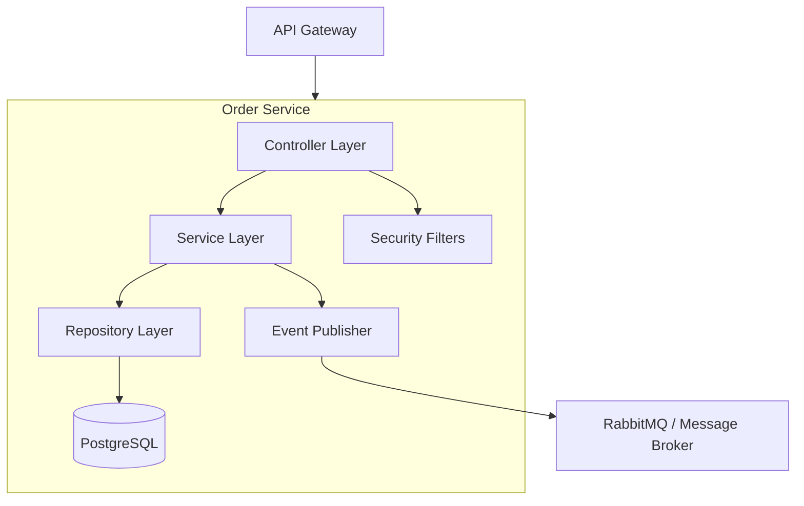
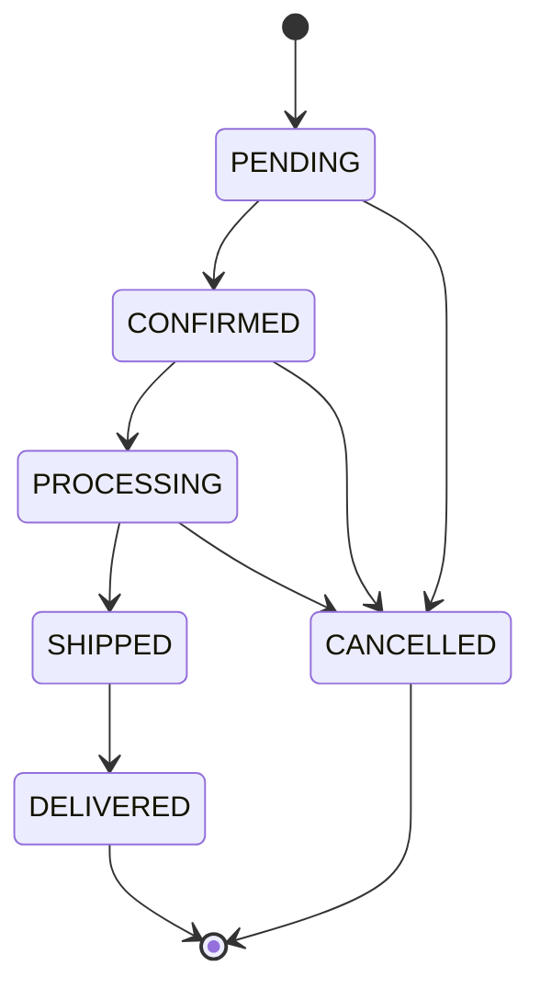
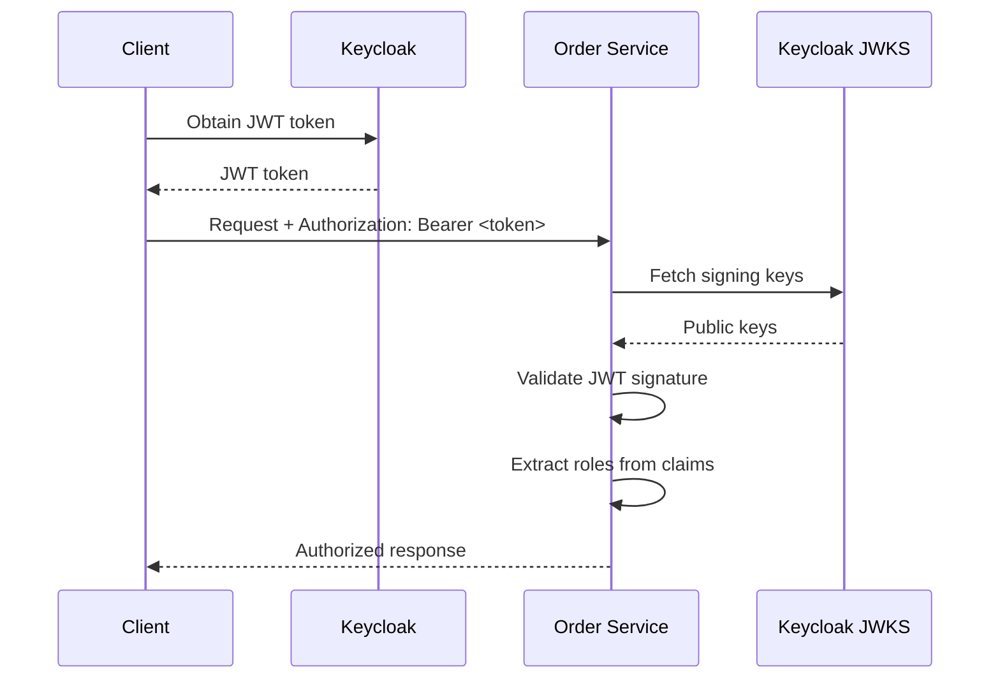

# Order Service Architecture

## Overview

The Order Service is a Spring Boot microservice responsible for managing customer orders in the Shopping Cart platform. It provides RESTful APIs for order creation, retrieval, and lifecycle management.

## Technology Stack

| Component | Technology | Version |
|-----------|------------|---------|
| Runtime | Java | 21 (LTS) |
| Framework | Spring Boot | 3.2.x |
| Database | PostgreSQL | 15+ |
| Message Queue | RabbitMQ | 3.12+ |
| Build Tool | Maven | 3.9+ |

## Architecture Diagram



## Component Details

### Controller Layer
- **OrderController**: Handles HTTP requests for order operations
- Input validation using Jakarta Bean Validation
- Request/Response DTOs for API contracts

### Service Layer
- **OrderService**: Business logic for order processing
- Transaction management
- Event publishing for order state changes

### Repository Layer
- **OrderRepository**: JPA repository for order persistence
- Custom queries for order lookups

### Security
- **SecurityConfig**: Base security configuration with headers and CORS
- **OAuth2SecurityConfig**: Keycloak JWT integration (when enabled)
- **RateLimitFilter**: IP-based rate limiting using Bucket4j

### Event Publishing
- **OrderEventPublisher**: Publishes order events to RabbitMQ
- Events: ORDER_CREATED, ORDER_UPDATED, ORDER_CANCELLED

## Data Model

### Order Entity

```java
@Entity
public class Order {
    private UUID id;
    private String customerId;
    private OrderStatus status;
    private List<OrderItem> items;
    private BigDecimal totalAmount;
    private LocalDateTime createdAt;
    private LocalDateTime updatedAt;
}
```

### Order Status Flow



## Security Architecture

### Authentication Flow



### Security Headers

| Header | Value | Purpose |
|--------|-------|---------|
| X-Content-Type-Options | nosniff | Prevent MIME sniffing |
| X-Frame-Options | DENY | Prevent clickjacking |
| X-XSS-Protection | 1; mode=block | XSS protection |
| Content-Security-Policy | default-src 'self' | Content restrictions |
| Referrer-Policy | strict-origin-when-cross-origin | Referrer control |

## Configuration

### Environment Variables

| Variable | Description | Default |
|----------|-------------|---------|
| `SPRING_DATASOURCE_URL` | PostgreSQL connection URL | - |
| `SPRING_RABBITMQ_HOST` | RabbitMQ host | localhost |
| `OAUTH2_ENABLED` | Enable OAuth2 authentication | false |
| `OAUTH2_ISSUER_URI` | Keycloak issuer URI | - |

See [Configuration Guide](../guides/configuration.md) for complete list.

## Related Documentation

- [API Reference](../api/README.md)
- [Troubleshooting Guide](../troubleshooting/README.md)
- [Development Guide](../guides/development.md)
